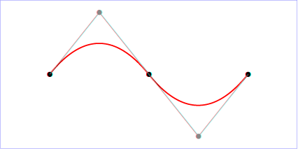

### This post covers :

 - What’s a bezier equation?
 - Creating a 3d surface patch using Bezier curves
 - Making it interactive

_figure 1: Screenshot of experiment_

### So what’s a Bezier curve:

Its a cubic parametric curve used to draw smooth curves, we can draw a bezier curve using two endpoints and two control points. It looks something like:

_figure 1: Bezier Curve - [Wikipedia](http://en.wikipedia.org/wiki/B%C3%A9zier_curve)_

So how to draw the surface using multiple bezier curves:

### Well there are multiple ways, here’s what I did:

 - Drew my first Bezier curve (The top one) and kept track of 10 equidistant points on that curve say HP.
 - Drew first vertical Bezier curve (The left one) and kept track of 10 equidistant points on that curve say VP.
 - Now for each point in HP draw a vertical bezier with same control points. Similarly for all points in VP draw horizontal Bezier curves with same control points.
 - In the meanwhile you can draw points at equidistant points on each bezier curve.
 - The code looks something like:


function plot() {
    ctx.fillRect(0, 0, canvas.width, canvas.height);
    // draw top line and find the points
    set[0] = [];
    set[1] = [];
    ctx.beginPath();
    ctx.moveTo(p1[0], p1[1]);
    drawPoint(p1[0], p1[1]);
    var c = 0;
    for(var t = 0; t <= 1; t += .001) {
        var x = Math.pow((1-t),3)*p1[0] + 3*t*(1-t)*(1-t)*p2[0] + 3*t*t*(1-t)*p3[0] + t*t*t*(p1[0] + width);
        var y = Math.pow((1-t),3)*p1[1] + 3*t*(1-t)*(1-t)*(p1[1] + d1)
                + 3*t*t*(1-t)*(p1[1] +d2) + t*t*t*p1[1];
        ctx.lineTo(x,y);
        ++c;
        if (c % 100 == 0) {
            set[0][set[0].length] = [x,y];
            ctx.stroke();
            drawPoint(x,y);
            ctx.beginPath();
        }
        
    }
    // draw first verticle line and collect the points 
    ctx.moveTo(p1[0], p1[1]);
    var c = 0;
    for(var t = 0; t <= 1; t += .001) {
        var x = Math.pow((1-t),3)*p1[0] + 3*t*(1-t)*(1-t)*(p1[0] + d1)
                + 3*t*t*(1-t)*(p1[0] +d2) + t*t*t*p1[0];
        var y = Math.pow((1-t),3)*p1[1] + 3*t*(1-t)*(1-t)*p5[1] + 3*t*t*(1-t)*p6[1] + t*t*t*(p1[1]+height);
        ctx.lineTo(x,y);
        ++c;
        if (c % 100 == 0) {
            set[1][set[1].length] = [x,y];
            ctx.stroke();
            drawPoint(x,y);
            ctx.beginPath();
        }
        
    }
    // draw all vertical lines in a loop
    // then draw horizontal lines in a loop
    for(i = 0; i <= 9; i++) {
        ctx.moveTo(set[0][i][0], set[0][i][1]);
        var c = 0;
        for(var t = 0; t <= 1; t += .001) {
            var x = Math.pow((1-t),3)*set[0][i][0] + 3*t*(1-t)*(1-t)*(set[0][i][0] + d1)
            + 3*t*t*(1-t)*(set[0][i][0] + d2) + t*t*t*set[0][i][0];
            var y = Math.pow((1-t),3)*set[0][i][1] + 3*t*(1-t)*(1-t)*(180)
            + 3*t*t*(1-t)*(300) + t*t*t*(set[0][i][1] + height);
            ctx.lineTo(x,y);
            ++c;
            if (c % 100 == 0) {
                set[0][set[0].length] = [x,y];
                ctx.stroke();
                drawPoint(x,y);
                ctx.beginPath();
            }
        }
    }
    for(i = 0; i <= 9; i++) {
        ctx.moveTo(set[1][i][0], set[1][i][1]);
        var c = 0;
        for(var t = 0; t <= 1; t += .001) {
            var y = Math.pow((1-t),3)*set[1][i][1] + 3*t*(1-t)*(1-t)*(set[1][i][1] + d1)
            + 3*t*t*(1-t)*(set[1][i][1] + d2) + t*t*t*set[1][i][1];
            var x = Math.pow((1-t),3)*(set[1][i][0]) + 3*t*(1-t)*(1-t)*(180)
            + 3*t*t*(1-t)*(300) + t*t*t*(set[1][i][0] + width);
            ctx.lineTo(x,y);
            ++c;
            if (c % 100 == 0) {
                set[0][set[0].length] = [x,y];
                ctx.stroke();
                drawPoint(x,y);
                ctx.beginPath();
            }
        }
    }
    ctx.stroke();
}


**How to make it interactive**: Simply change the control points according to input (mouse move, key press in my case)

Complete code available at my github repo: [My-Playground/inside-the-mesh](https://github.com/mebjas/my-playground/blob/master/is%20inside%20the%20mesh%3F/cloath.htm)

How about we add a star to it?
