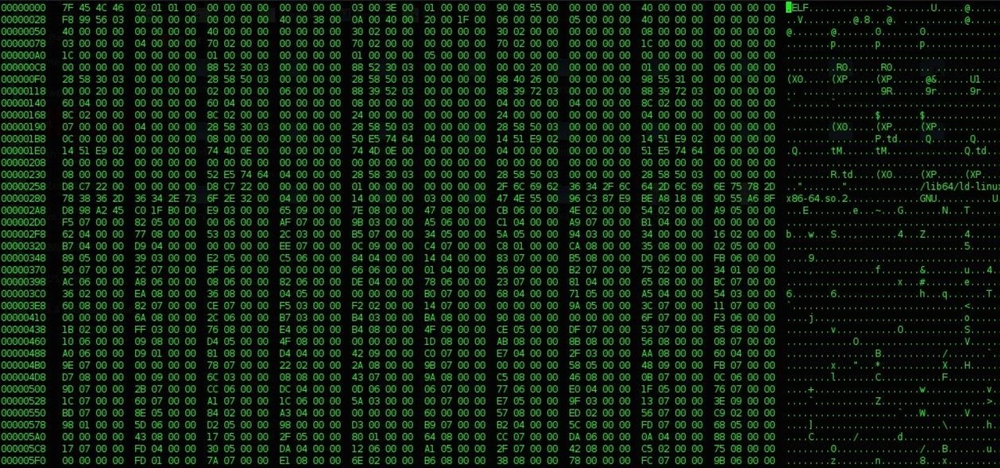

{:width="750px"}
## Problem

Recently an interesting bug came up in CSRF Protector PHP. Read the entire [issue thread on Github](https://github.com/mebjas/CSRF-Protector-PHP/issues/51).

 > If you log out of your website and then try to login again there only, CSRF Protector throws 403 – forbidden response.

So this comes by design, because first thing that you do in your logout script is, initiate CSRF Protector and then let it do it’s stuff and then destroy session to logout the user. Now this screws everything because CSRFP is dependent on tokens it store in session variables. So next time you try to login again which is a POST request, it’s unable to validate the incoming token and throws 403 or whatever is the `failedValdiationResponse` in your config.

## Solution
Now since, this is a very particular issue I don’t feel library should handle it implicitly. What needs to be done is:

 1. Do not destroy entire session in logout – just unset the key you deal with for authentication. Now this might need you to change the design, which is far difficult than not using CSRFP itself. So use this if your user authentication is dependent on particular keys in session vars.
 2. Now this would look like a university student workaround. Store existing tokens in temp variable, destroy session then start session again and restore `$temp` back to session.
    ```php
    if (isset($_SESSION["CSRFP_TOKEN"])) $temp = $_SESSION["CSRFP_TOKEN"];
        // Now CSRF_TOKEN key need to be pulled from config.
        @session_unset();
        @session_destroy();
        @session_start();
        if (isset($temp)) $_SESSION["CSRFP_TOKEN"] = $temp;
    ```
 3. **Best way to deal with this would be**: if you are using `session_destroy()` to logout, call `csrfp::csrfProtector::init();`. This would ensure user logs out and init() would create a new session with new tokens in it.

Hope these workaround works for you. Else feel free to reach out to me by posting another issue on [mebjas/CSRF-Protector-PHP](https://github.com/mebjas/CSRF-Protector-PHP)