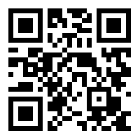
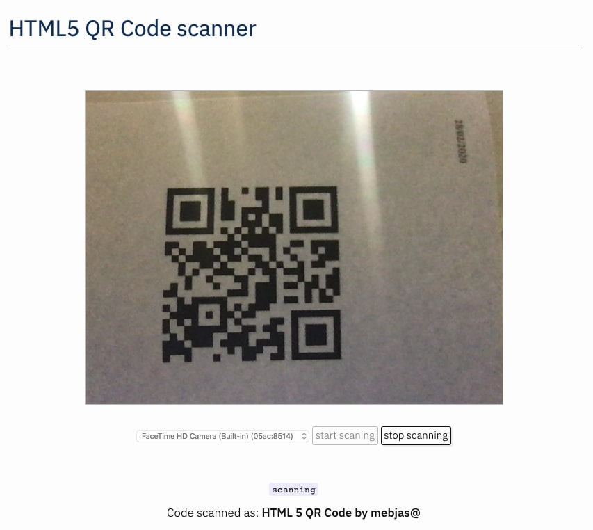
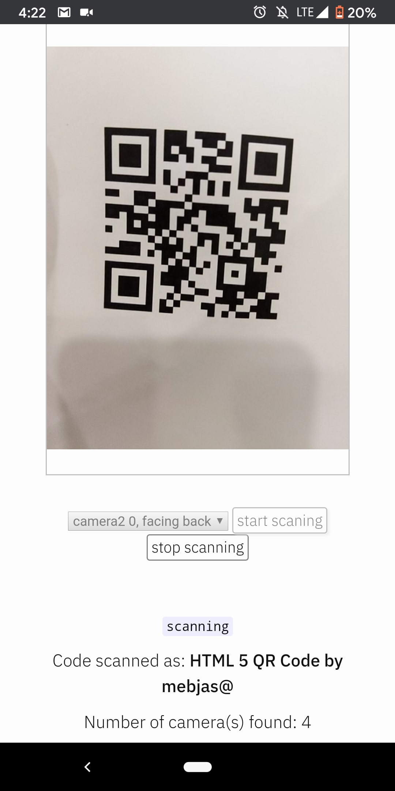

<!-- NOTE: this article will have assets not under post 14 -->

LazarSoft had written an excellent set of [QR code decoding javascript libraries](https://github.com/LazarSoft/jsqrcode). However, it still requires some efforts to integrate the work with a web project as we need to take care of enumerating different camera devices, setting up `canvas` or the `video` element and hooking the stream with `qrcode library`. Also recently, in leu of privacy concers, some javascript APIs related to accessing the camera has changed and it requires some efforts to ensure different platforms like mobile or PC, chrome or safari support it. To reduce these pain points I wrote a jQuery based wrapper on to abstract tasks like camera enumeration and UI setup - it can be found at [mebjas/html5-qrcode](https://github.com/mebjas/html5-qrcode). In this article I have documented some details on how to use it and what is happening under the hook.

## Introduction
<!-- TODO(mebjas) Add more details on QR code. -->
QR Code is a very common technique of encoding information as images. I ts a very common used in physical stores for identifying products like bar code is used.

<br>
_Figure: A sample QR code_

The `jQuery` library available at [mebjas/html5-qrcode](https://github.com/mebjas/html5-qrcode) on Github allows users to add a QR code scanner in their web applications. It works cross-platform and across different devices like PC, Mac or smartphones. It uses the `stream` from the camera and try to decode frames at certain frequency (configurable) and notify the caller about results via callbacks. Requesting camera usually results in a popup to user for permissions and can only be used if the user grants the permission.

{:width="400px"}
<br>
_Figure: Sample permission flow triggered by Chrome browser on Mac_

## Demonstration
A demo for this project is hosted at [https://blog.minhazav.dev/research/html5-qrcode.html](https://blog.minhazav.dev/research/html5-qrcode.html)

## How to use
### Clone the project and include the libraries
Clone the project at appropriate location in your project. 
```sh
git clone https://github.com/mebjas/html5-qrcode.git
```

Include the three main libraries into your HTML page
```html
<script src="./jqeury.js"></script>
<script src="./jsqrcode-combined.js"></script>
<script src="./html5-qrcode.js"></script>
```

### Add a palceholder element in HTML
```html
<div id="reader"></div>
```
Add an empty HTML element at appropriate position in your HTML code, give it an `id`. The library uses this element to insert some hidden HTML elements which shows up as a viewfinder (camera input is shown in this html element) to the user performing QR code scan.

### Enumerate all available cameras
The library exposes a method just for this called `html5_qrcode_getSupportedCameras(..)`. It takes two callbacks as arguments namely `successCallback` and `errorCallback`.

This method takes in two callbacks. One for success and later one for failures. Both callbacks have this kind of interface:
```ts
interface Device {
    id: String;     // Id of the camera
    label: String;  // User visible name of the camera like
                    // Front Camera. This is not always set
                    // for all devices from privacy standpoint.
}

successCallback: Function(Array(Device))
errorCallback: Function(String)
```

#### Sample code:


$(document).html5_qrcode_getSupportedCameras(
  function (devices) {
    /**
     * devices would be an array of objects of type:
     * { id: "id", label: "label" }
     */
    if (devices && devices.length) {
      var cameraId = devices[0].id;
      // .. use this to start scanning.
    }
  }, function (error) {
    // handle errors
    console.error("Enumerating cameras failed. ", error);
  }
);


### Once you have `cameraId` you can pefrorm start/stop operations
Starting the camera implicitly starts QR Code scanning. It runs at a certain fps prvided in `ExtraConfiguration`. This is an optional field and by default the scanner runs at `2 fps`.

Use `html5_qrcode()` to start scanning. Once you call this with sucess, it'd start streaming the camera input to a `video` and `canvas` element. Also, QR code library would be processing the frames at a certain frequency configurable by users. The method looks like:

```ts
interface ExtraConfiguration {
    fps: Integer; // frames per seconds to be processed.
}
html5_qrcode(
    cameraId: String,
    qrcodeSuccessCallback: Function(qrCodeMessage: String),
    qrcodeErrorCallback: Function(errorMessage: String),
    videoErrorCallback: Function(errorMessage: String),
    config: ExtraConfiguration
) : Function
```

Except `config` other arguments are important and should be sent as argument.

The difference between `qrcodeErrorCallback` and `videoErrorCallback` is that the former one is called in case of QR code processing failure while latter is called during the setup part or in case of issues related to initialization or access.

#### Sample code:


$('#reader').html5_qrcode(
  cameraId,
  function (qrCodeMessage) {
    console.log("QR Code decoded. Message = " + qrCodeMessage);
  }, function (errorMessage) {
    console.error("Error processing QR code. ", errorMessage);
  }, function (errorMessage){
    console.error("Error getting stream. ", errorMessage);
  },
  { fps: 10 });


#### For stopping an ongoing scanning, just call

$('#reader').html5_qrcode_stop();


This disables and hides the viewfinder shown during scanning and cleans up the resources. `html5_qrcode(..)` can be called again after this method.

#### Sample implementation
Link to source code for the demo project - [research/html5qrcode at blog.minhazav.dev](https://github.com/mebjas/mebjas.github.io/blob/master/_layouts/research/html5qrcode/layout.html)

## How to contribute
If you are excited or interested you can contribute to this project by:
 - Raising issues for bugs faced, at [Github issue page for the project](https://github.com/mebjas/html5-qrcode/issues). Feel free to add some related interesting discussions which could be taken up as workitem.
 - Sending a Pull Request for bugs fixed by you.
 - Rating the project with stars and shares.
 - Sponsor the project with Github Sponsorship

## Screenshots
{:width="600px"}<br>
_Figure: Demo running on Chrome browser on Macbook Pro_

{:width="600px"}<br>
_Figure: Demo running on Safari browser on iPad_

{:width="300px"}<br>
_Figure: Demo running on Chrome browser on Pixel 3 (Android)_

## References
 - QR Code on Wikipedia - [Wikipedia](https://en.wikipedia.org/wiki/QR_code)
 - Project on Github - [mebjas/html5-qrcode](https://github.com/mebjas/html5-qrcode)
 - Demo link - [https://blog.minhazav.dev/research/html5-qrcode.html](https://blog.minhazav.dev/research/html5-qrcode.html)
 - QR Code decoding library - [LazarSoft/jsqrcode](https://github.com/LazarSoft/jsqrcode)