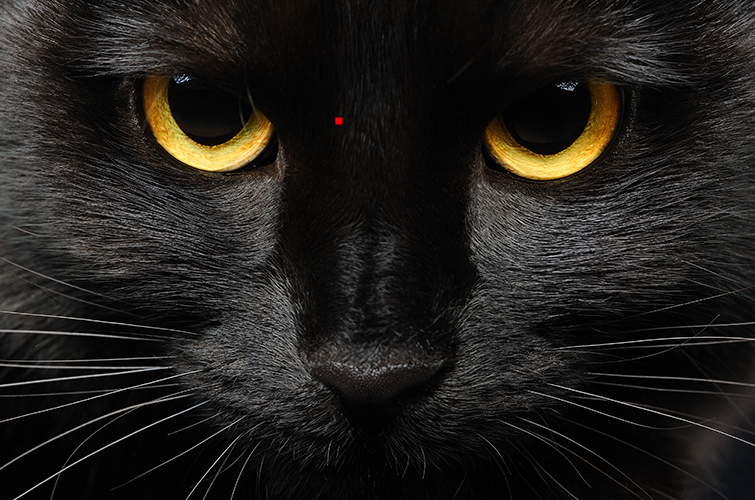

## Draft: This is work in progress

## Introduction
Android is one of the most popular mobile operation system in the market today. It's an open source mobile operating system by Google and is shipped by several OEMs like Samsung, Redmi, Oppo, Vivo, Nokia etc. Towards the end of last decade camera has emerged as one of the most important factor that contributes towards smartphone sales and different OEMs are trying to stay at the top of the throne. Differnt android flagships including Google owned Pixel(s) have been directly competing with Apple Iphone over the years and giving it a touch competition. In this post I'll be describing various algorithms implemented in Android camera subsystem that is consistent across OEMs which are used to produce stunning images that we capture from Camera Applications.

### Legends:
 - HAL: Hardware Access Layer
 - ISP: Image Signal Processor
 - DSP: Digital Singal Processor
 - 3A: Auto Exposure, Auto Focus, Auto White-Balance

## Camera Subsystem in Android
As per [source.android.com](https://source.android.com/devices/camera) on Android Camera:
> Android's camera hardware abstraction layer (HAL) connects the higher-level camera framework APIs in Camera 2 to your underlying camera driver and hardware. __The camera subsystem includes implementations for camera pipeline components__ while __the camera HAL provides interfaces__ for use in implementing your version of these components.

The camera susbsystem includes implementation of fundamental image processing algorithms that converts `RAW Bayer output` from camera sensor to full fledged image that can be consumed by applications and users. I have explained [Android camera hardware architecture](https://blog.minhazav.dev/android-camera-hardware-explained/) in detail in another article.

{:width="500px"} 
_Figure: Camera Pipeline as per Android Source_

### Camera Sensor and RAW input
As described in [this post](https://blog.minhazav.dev/android-camera-hardware-explained/#sensor) the output of camera sensor only contains information on one color per pixel as compared to three color (RGB) per pixel we intutively assume.

{:width="500px"} 
_Figure: Output from camera sensor._

The output from camera sensors are preserved in a format called RAW. RAW image is often called digital negatives. A RAW image can only be consumed by specialized image viewing tools but is popular amongst photographers as it preserves the image as it was captured by Camera without loosing information.

The outputs of Android camera subsystem are consumed by applications or application layer. Most OEMs add support for JPEG and YUV image as output from camera, while some add support for returning RAW image directly as well. You can think of YUV as a processed image which is ready to be consumed. While JPEG is compressed image format that represents a processed image.

### Image Processing done in Camera Subsystem

#### Hot pixel correction
 {:width="500px"}  
 _Figure: Image with incorrect red pixel ([Image via Shutterstock](http://www.shutterstock.com/pic-84216661/stock-photo-closeup-portrait-of-a-halloween-black-cat.html?src=M6Qs_EDxVIIVJ36sl_5sqQ-1-1))._

TBD

#### Demosaic
 {:width="500px"}  
 _Figure: Image as captured by sensor (Right) and Image produced after processing (Left)._

**Did you know almost 2/3 of image you see is made up?**

TBD

#### Noise reduction
{:width="500px"}  
_Figure: Image with noise._

TBD

#### Shading correction
{:width="500px"}  
_Figure: (Right) Image with vignetting from sensor and (Left) after applying lens shading correction._

TBD

#### Geometric correction
{:width="500px"}  
_Figure: Image before geometric correction._

TBD

#### Color correction
TBD

#### Tone Curve adjustment
TBD

#### Edge enhancement
TBD 

After applying these steps (or more as implemented by HAL of different OEMs) RAW image can be converted to YUV. YUV images are usually large in size with `1.5 Bytes per pixel`. This means a `12 MP image (4000 X 3000)` will occupy around `17.2 MB` in memory. To save size of output image written to disk an image is usually compressed and JPEG is more popular format for this at the moment. Jpeg encoding is supported at HAL level as it can be efficiently done at hardware level.

If you are writing an application on top of Android Camera and intend to perform your own processing on top of image returned by framework you should request image in `YUV` format. OTOH, if the goal is to directly write the image to disk `JPEG` image should be used.

> If the goal is to just save the image to disk and then act on it, it'd both easier and faster to use [Android Camera Intent](https://developer.android.com/training/camera/photobasics) than implementing the camera.

If you request a YUV image and perform some image processing on top of it and finally save to disk, you'd still need to pay cost of JPEG encoding. Jpeg encoding usually takes around `~ 800 ms` vs `~ 90 ms` at software vs hardware layer respectively for a 8MP image on a simple quad core system. This can however be optimised by using Reprocessing APIs supported in later version of Android. I'll be writing more about it soon.
<!-- TODO(mebjas): add link to article on reporcessing API. -->

## References
 - [Android Camera Architecture explained - minhazav.dev](https://blog.minhazav.dev/android-camera-hardware-explained/)

