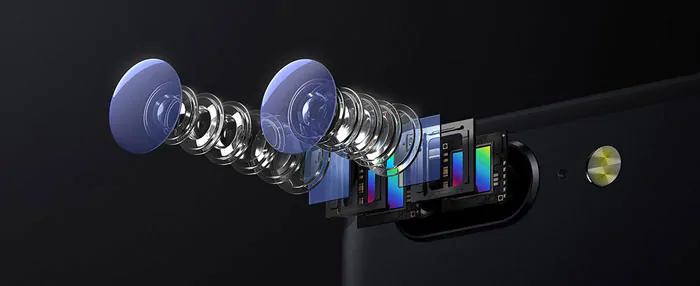
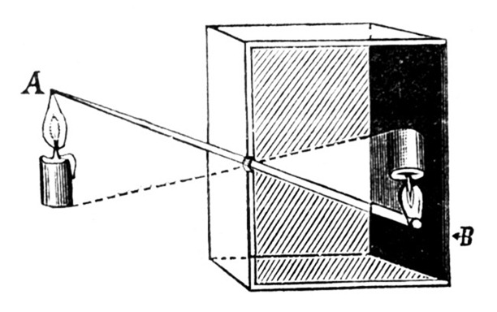
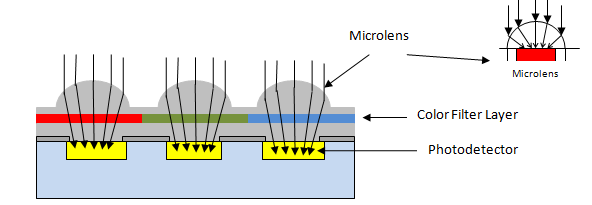
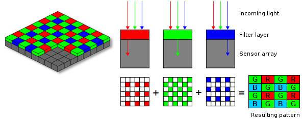
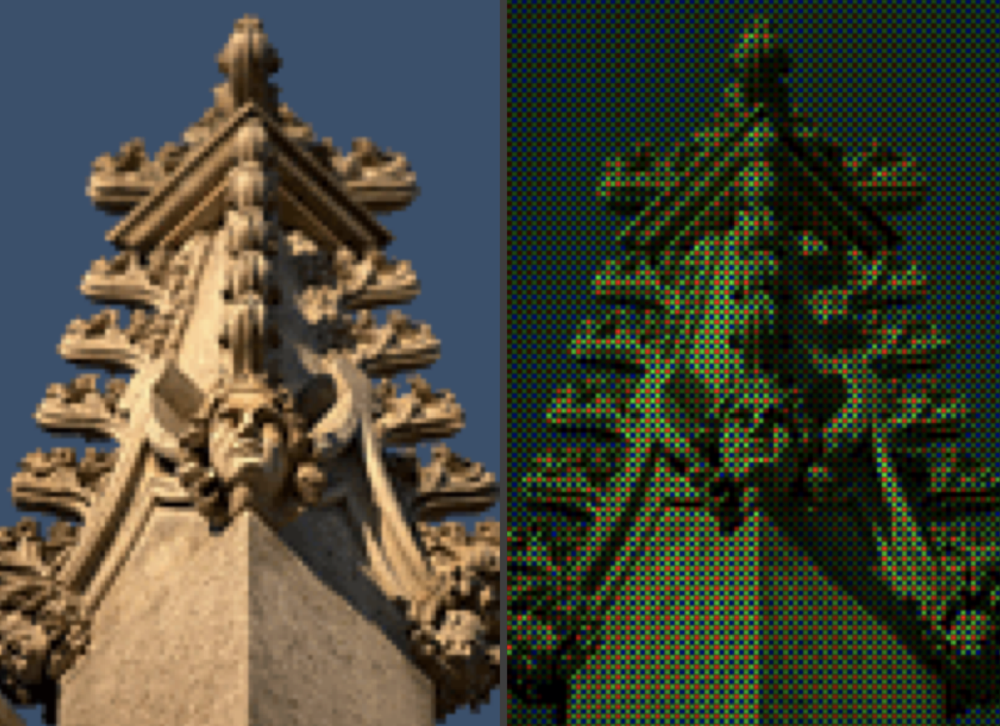
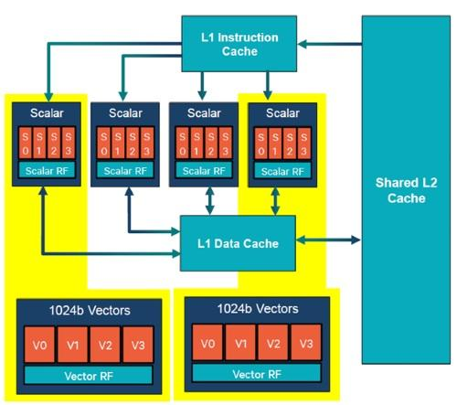

{:width="500px"}

Android is the most popular mobile operating system in the market today. Towards the end of last decade, camera has emerged as one of the most important factors that contributes towards smartphone sales and different OEMs are trying to stay at the top of the throne. Smartphone cameras are built very similar to digital cameras in a compact package. With high end processing capabilities it has taken a big leap and is competing with digital cameras today. In this post I'll be covering the general hardware architecture of modern Android Camera.

{:width="700px"} 
_Figure: Android Camera low level architecture ([source](source.android.com)). Many of the basic steps are done in specialized hardwares explained in detail below._

## Components
<!-- TODO(mebjas): add the cross section diagram -->

{:width="500px"} 
_Figure: Pin hole camera._

Around 400BC to 300BC, ancient philosophers of certain cultures were some of the first peoples to experiment with the camera _obscura design_ for creating images. The idea is simple enough — set up a sufficiently dark room with only a tiny bit of light entering through a pinhole opposite a flat plane. The light travels in straight lines, crosses at the pinhole, and create an image on the flat plane on the other side. The result is an upside-down version of the objects being beamed in from the opposite side of the pinhole—an incredible miracle, and an amazing scientific discovery for people that lived more than a millennium before the “middle ages.”

1000 of years later cameras have taken a big leap and now tiny cameras are available on smartphones capable of capturing dense images competing with full-fledged digital cameras. A standard camera on the smartphone have following components:

### Legends:
 - HAL: Hardware Access Layer
 - ISP: Image Signal Processor
 - DSP: Digital Singal Processor
 - 3A: Auto Exposure, Auto Focus, Auto White-Balance
 - SOC: System on a Chip
 - OIS: Optical Image Stabalisation

### Lens
The task of the lens is to focus the incoming light into the sensor. 
 - The horizontal movement of the lens allow change in focus. 
 - Some camera chassis allow vertical or multi axis movement of the lens (some times sensors) against the movement of the camera on the whole to provide stabilisation against sudden movements. This is called Optical Image Stabalisation (OIS). It helps is capturing less blurry or stable video.
 - The aperture is used to control the amount of light that enters the sensor is usually part of lens. Smartphones comes with fixed aperture lens. To provide functionalities similar to digital cameras which come with variable aperture lens, smartphones these days comes with multiple lenses.

### Shutter
Shutter speed is one of the factors that controls how much light is sensed by the sensor or for how long. This has traditionally been controlled by a mechanical component called shutter.

Given that smartphones are very tiny devices, it shouldn’t be any surprise that the last mechanical camera part before the sensor — the shutter has been omitted from their designs. Instead, they use what’s called an electronic shutter (E-shutter) to expose your photos. Essentially, your smartphone will tell the sensor to record your scene for a given time, recorded from top to bottom. While this is quite good for saving weight, there are tradeoffs. For example, if you shoot a fast-moving object, the sensor will record it at different points in time (due to the readout speed) skewing the object in your photo.

### Sensor
> Light travels through a lens, the shutter opens, and a moment is preserved by capturing it on the camera’s sensor.

The basic building blocks of an image sensor are photodiodes which perform the conversion of light.

 {:width="500px"}  
 _Figure: Basic image sensor._

As the camera’s sensor is photosensitive, when light photons are collected in the photosites (one photosite for each pixel), a tiny electrical charge is produced. Usually, the photodiodes employed in an image sensor are color-blind by nature, because they can only record shades of gray. To get color into the picture, as shown in Figure above, they are covered with a filter on top. This filter is usually a palette like red, green and blue (RGB) according to the pattern designated by the Bayer filter. The color image sensor uses Bayer filter to output raw Bayer image.

Usually, the pattern of color filters is arranged in such a way where half of the total number of pixels are green (G), while a quarter of the total number is assigned to both red (R) and blue (B), the reason is a human eye is more sensitive to green color. When the image sensor is read line by line, the pixel sequence comes out as GRGRGR, etc., and then the alternate line sequence is BGBGBG, etc. as shown in below diagram. 
 {:width="500px"}  
 _Figure: Bayer Transformation._

The raw output produced from Bayer-filter cameras is referred to as a Bayer image. This image is then further processed using ISP pipeline to achieve quality pictures with all the necessary corrections applied.

#### Types of sensors used poplularly
 - **CCD (Charge-Coupled Device)**: In CCD type of image sensor, when light strikes the chip, it is held as a small electrical charge in each photo sensor. The charges in the line of pixels nearest to the output amplifiers are amplified and converted to an output, followed by each line of pixels shifting its charges one line closer to the amplifier.
 - **CMOS (Complementary Metal Oxide Semiconductor)**: A CMOS imaging chip is a type of image sensor that uses several transistors to amplify each pixel instead of a few CCD amplifiers and move the charge using more traditional wires. It uses red, green, and blue color filters and it uses red, green, and blue color filters and passes data through metal wiring and onto photodiodes. Most modern sensors are of the CMOS variety.

Nearly all camera phones use CMOS active-pixel image sensors (CMOS sensors), due to largely reduced power consumption compared to charge-coupled device (CCD) type cameras, which are also used, but in few camera phones. Some of camera phones even use more expensive CMOS back-illuminated sensors, which uses less energy than CMOS, although more expensive than CMOS and CCD.

### Flash
> A flash is a device used in photography producing a flash of artificial light (typically 1/1000 to 1/200 of a second) at a color temperature of about 5500 K to help illuminate a scene. A major purpose of a flash is to illuminate a dark scene.

 {:width="300px"}  
 _Figure: Image exposed without additional lighting (left) and with fill flash (right)._

Flash is syncronised with photo capture process typically one during the 3A process and other before the capture to get optimal exposure. During video capture flash is usually used as torch. These days with advancement in `Night Mode` algorithms which are based on high exposure, noise reduction, multi frame merge and ML algorithms use of flash is getting less popular. 

### ISP: Image Signal Processor
> An image signal processor, also called image processing engine, is a specialized digital signal processor used for image processing in digital cameras, mobile phones or other devices. 

Taking light from the camera sensor and converting it to beautiful images requries complicated process involving large amount of math and processing. ISP is specialized hardware capable of performing these steps in energy efficient way. Some of the algorithms that are run on ISP are:

 - **Auto Focus, Auto White Balance:** Auto focussing ensures the resulting images are sharp. There are different types of auto focus algorithms which an ISP can implement. This is explained in detail in my former article - [android camera subsystem](https://blog.minhazav.dev/android-camera-subsystem-basic-image-processing-steps-done-at-hardware-level-in-android-camera/). ISP also monitors and adjust color and white balance as well as exposure in real time so that the pictures don't come out too dark or bright or off coloured. All of this happens even before the shutter button is clicked.
 - **Demosaic:** The CMOS sensors doesn't sense RED, BLUE and GREEN for each pixel. It senses one color for each pixel and the RGB value for each pixel is guessed by ISP. This is called demosaicing and it's probably primary task taken care of by an ISP.
 {:width="500px"}  
 _Figure: Image as captured by sensor (Right) and Image produced after processing (Left)._
 - **Shading correction and geometric correction:** Once an ISP has RAW image data it runs algorithms to fix lens shading or curvature distortion.  
  {:width="500px"}  
 _Figure: Image before geometric correction._
 - **Statistics**: ISPs can efficiently peform statistical operations on incoming signals like - histogram, sharpness maps etc.

ISP is generally onboard SoC but can come discretely as well. An ISP is essentially one of the major limiter of how many Mega Pixels a camera (or smartphone) can efficiently process. For example Qualcomm's latest Spectra 380 ISP is engineered to support upto 48 MP or two 22 MP sensors at once.

### DSP: Digital Signal Processor
 >  DSP is a specialized microprocessor chip, with its architecture optimized for the operational needs of digital signal processing.

The operations peformed by a DSP can be executed by general purpose processors but DSP can perform them more efficiently and with higher performance. Some of the operations performed efficiently using DSP are:
 - Matrix Operations
    - Convolution for filtering
    - Dot product
 - Polynomial evaluation
 - Fast Fourier transformation

Efficient & performant processing of `vector math` by DSP has made it a great choise of SoC for many machine learning and image processing operations making it ideal choice for smart phone cameras. They are often called **Neural Processing Unit**, **Neural Engine** or **ML Processors**.

Qualcomm's Hexagon is brand for family of DSPs with 32 bit multi threaded architecture. The architecture is designed to provide high performance with low energy usage.

{:width="500px"} 
_Figure: The Hexagon DSP architecture in the Snapdragon 835. Source: Qualcomm._

The Snapdragon 845’s Hexagon 685 DSP can handle `thousands of bits of vector units per processing cycle`, compared to the average `CPU core’s hundreds of bits per cycle`. Some other SoCs with specialized hardware for ML processing have been included in smartphones by different OEMs like Huawei and Apple.

### Specialized hardware in latest smartphones
OEMs have been introducing specialized hardware primarily to boost machine learning capabilities which are being extensively used in image processing. Initially these were being done in software layer executed on CPU or GPU. But specialized low level hardwares have helped reduce latency of such processing steps to provide support for features like live HDR (HDR on viewfiner), 4K video recording with HDR etc. Two outstanding OEMs who introduced such hardware were Google and Iphone.

#### Google Pixel Visual Core
Google introduced a secret chip in Google Pixel 2 and Pixel 2 XL alongside main processing components to enhance image processing capabilities. According to Google this extra chip brought in around 5X improvement in HDR+ processing time at 1/10th power consumption. Pixel Visual core was designed to handle complex machine learning algorithms related to image processing. It was reintroduced in Pixel 3 series as well.

#### Apple Iphone bionic chips
Apple has been bringing in A series chips like A13 Bionic chip introduced in Iphone 11. They claim to pack CPU, GPU and a _neural engine_ for boosting machine learning performance. In their latest chip Apple claimed to have boosted matrix multiplication to 6X faster which is core of many ML operation. Apple say's it's using ML in iphone 11's camerato help process their images.

### CPU and GPU
After getting the image from the camera in `RAW`, `YUV` or `JPEG` format the camera application can runt the image through more general image processing algorithms which are usually run on general purpose processors like CPU or GPU.

In later version of `Android Reprocessing APIs` were introduced that allows the software layer to submit the image back to framework then HAL for running certain image processing algorithms on them in specialized hardwares mentioned above for better performance. I'll explaining this in detail in a separate architecture.

<!-- TODO(mebjas): add link to the article. -->

## References
 - [Android Source - Camera](https://source.android.com/devices/camera)
 - [Stanford lecture - camera processing pipeline](https://web.stanford.edu/class/cs231m/lectures/lecture-11-camera-isp.pdf)
 - [Android Authority - Pixel visual core](https://www.androidauthority.com/pixel-visual-core-808182/)
- [The Verge - Apple's new A13 Bionic chip](https://www.theverge.com/circuitbreaker/2019/9/10/20857177/apple-iphone-11-processor-a13-cpu-speed-graphics-specs)
- [DSP - Wikipedia](https://en.wikipedia.org/wiki/Digital_signal_processor)
- [Qualcomm Hexagon 685 DSP - XDA Developers](https://www.xda-developers.com/qualcomm-snapdragon-845-hexagon-685-dsp/)
- [Peek inside camera - EInfochips](https://www.einfochips.com/blog/a-peek-inside-your-camera-i-image-signal-processing-isp-pipeline/)
- [Flash photography - Wikipedia](https://en.wikipedia.org/wiki/Flash_(photography)#Technique)

