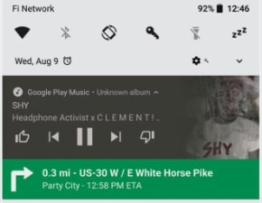
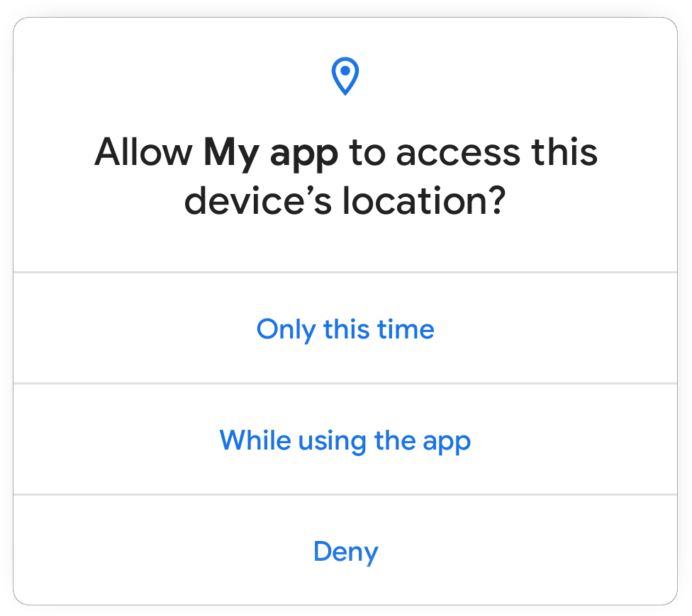
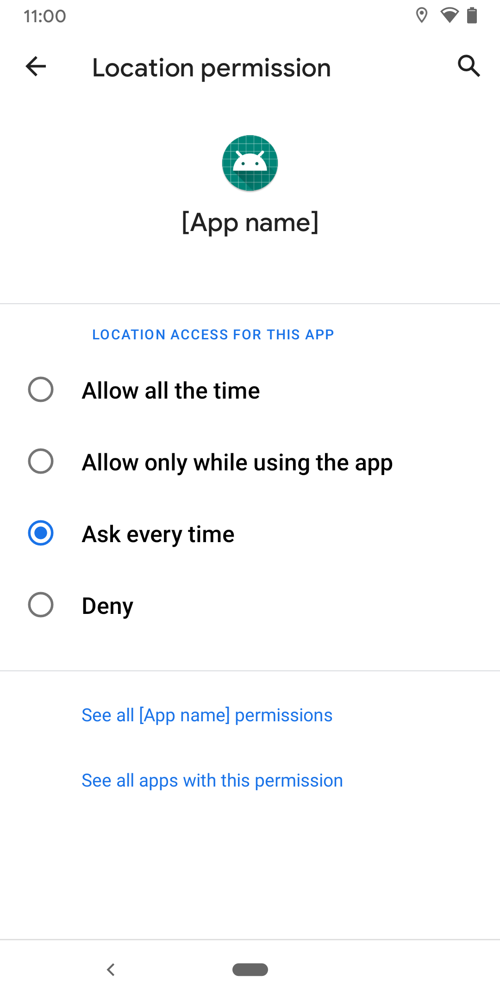

<!-- NOTE: this article will have assets under post 13 -->

Android has released a [developer preview of Android 11 (aka Android R) for the Pixel series (and emulator)](https://android-developers.googleblog.com/2020/02/Android-11-developer-preview.html) last week. As per the blog article, many changes have been introduced to support upcoming technologies like 5G, foldable displays, machine learning APIs and to strengthen Android's position in privacy and security. On top of that, I could see a couple of additions to support ongoing trends like pinhole or waterfall screens or giving first-class support for bokeh in Camera. In this article, I'd be exploring some of these changes and explaining what it means for developers (including myself) and the mighty users.

> **Disclaimer:**
> 
> The following article is purely based on articles made publicly available by Android Team. It purely represents my comprehension and opinions around the features. I have looked into these purely as a consumer of Android devices or a developer of Android applications. There doesn't represent the opinions of the organization I work for.

This article is part 1 in a series of articles I intend to write while tracking new public updates from the Android team as a developer working on Android applications.

If you are interested in getting hands dirty please check the section on - [How to flash](#how-to-flash-android-11-into-your-pixel-device). 

## User Privacy
I am going to write about this one since it's the one I like the most: Android has been adding more and more privacy features over time and with Android 11 they have brought some major deals for the consumers and some slightly radical changes for the developers.

### One-time permission
{:width="300px"}
<br><span class="image-caption">_Figure: Preview of permission flow_</span>

Users can now grant one-time permission to apps, which means the app's users don't trust cannot continue to use risky permissions like geo-location forever, once a user has granted them. Looks like this has been selectively added for permissions like `location`, `microphone` and `camera` to keep it less confusing. If a user chooses to grant one time, then the app can access the related data only while one of the following holds:
  - The app's activity has been visible ever since the permission was granted. 
   > For the users, it means as far as the app continues to be on the front screen the app will hold the permissions.
  
  - The app was visible when the permission was granted and has been running a foreground service since then. After that, the app shall retain the permissions as far as the foreground service is alive even if the app moves to the background.
  > For the users, an app with foreground service can be identified by a sticky notification that cannot be swiped away. For example, when you start navigation on Google Maps. As far as this notification continues to show up after the permission was granted to the app, the app will have access to those permissions.

      
      <br><span class="image-caption">_Figure: Foreground notification for a music player and Google Maps._</span>

Read more about this [here](https://developer.android.com/preview/privacy/permissions).

### Data Access Auditing
Sometimes app developers integrate third-party SDKs in their app to leverage some features provided by the SDK author rather than building everything on their own. An example would be integrating the Facebook SDK to integrate Facebook-related features in the app. Now such SDKs acts as a black box residing in the app and hold the same level of permissions as the app itself - which could be misused by SDK authors.

> I have not been a victim of this scenario yet, but this sounds both interesting and a real problem.

Android 11 is introducing data access auditing to provide more transparency into how the app and the dependencies are accessing private data. An app can register an instance of `AppOpsManager.AppOpsCollector`, which provides callbacks when the app or dependency attempts to access private data. This can be used by developers to better identify and rectify potentially unexpected data access.

> This seems to be in good faith with users' trust in the applications. I would recommend everyone to use this while development.

Read more about this [here](https://developer.android.com/preview/privacy/permissions#data-access-auditing).

### Background Location Access
The user's location is very privileged information and should be dealt with care. Background location access is risky permission as once the user grants it the app can continue to track the user location without the user knowing it fully. I feel very strongly against using users' location information unless required. Android 11 seems to have brought some changes in our (users') favour.

For starter, the ability to grant background location access from in-app prompt has been removed.
{:width="300px"}<br>
<span class="image-caption">_Figure: In-app dialog for location permissions no longer includes the "allow all the time" option._</span>

If your app really needs background location access, starting Android 11 you will need to convince the users that you need it and why you need it. To get background location access in Android 11, you'll need to do the following steps:
 - Include the `ACCESS_BACKGROUND_LOCATION` permission in manifest along with `ACCESS_COARSE_LOCATION` or `ACCESS_FINE_LOCATION`.
 - Request the runtime location access which will open a prompt like shown above. Wait for the user to grant this permission.
 - (Optional but highly recommended) Now display a UI that explains why your app needs background location access with a button or some interactive element to request.
 - When the user clicks on the button, request the `ACCESS_BACKGROUND_LOCATION` runtime permissions or otherwise direct the user to your app info page in system settings.
      {:width="300px"}<br>
      <span class="image-caption">_Figure: The app info page will have option to grant background location access._</span><br><br>
 - Note that the user can reduce the permission or deny the permission here as well. If the permission is denied multiple times system shall start ignoring the permission request.

And it'd be good if the app can function even if background location access is not granted. This seems like a lot of work but worth it if this kind of high profile information is needed. Afterall mighty users are mighty users.

### Scoped Storage
Android has been tightening storage access over different generations of Android versions. In Android Q (Android 10), they introduced scoped storage access which was meant to restrict full external file system access to different applications. This introduced a kind of a sandboxed storage model where an App could read/write in its external directories (like `getExternalFilesDir()`) without permission but the rest of the external storage appeared to be inaccessible via FileSystem APIs. Apps could still access media (images, videos, etc) using the `MediaStore` APIs with `READ_EXTERNAL_STORAGE` and `WRITE_EXTERNAL_STORAGE` permissions but the raw file system access was restricted.

But since the changes were too radical, the Android team gave developers additional time for testing and apps that are targeting Android 10 (API level 29) or lower could still request the `requestLegacyExternalStorage` attribute by putting this in the manifest. This flag temporarily allowed developers to opt-out of this scoped access. Certain APIs like `Environment.getExternalStorageDirectory()` or `Environment.getExternalStoragePublicDirectory()` were marked as deprecated in API level 29 and new APIs were introduced as a fair warning for developers to migrate.

Now with Android 11, `requestLegacyExternalStorage` becomes obsolete and apps targeting Android 11 can no longer out of scoped storage access. Here's my understanding of what changes for developers:

#### Access to certain directories and files
The app can no longer use the `ACTION_OPEN_DOCUMENT_TREE` or `ACTION_OPEN_DOCUMENT` to request access to:
 - The root `Downloads` directory.
 - The root directory of each SD card.
 - The files in `Android/data/` or `Android/obb/` directory and all subdirectories.

#### Permission changes
Some of the changes in permissions include:
 - The `Storage` permission has been renamed to `Files & Media`.
 - If the app targets Android 11, both `WRITE_EXTERNAL_STORAGE` and `WRITE_MEDIA_STORAGE` permission will no longer provide additional access.

For the apps that have a core use case that requires full file access like for a File Manager they can get `All files access` by doing:
 - Declare `MANAGE_EXTERNAL_STORAGE` permission in the manifest.
 - Direct the user to a system settings page where the user can enable the **Allow access to manage all files** option for the app.

 > This is nice as it should make it harder for apps to get full file system permissions and might make users more vigilant when an app requests permission like this. Thus only apps with the core need shall take this kind of permission from users.

#### Runtime permissions to Edit / Favorite or Delete media
For apps that don't want to go through such hard permission flows, Android is adding some new MediaStore permissions to get run time permissions to access certain media. Permissions granted through this mechanism are tied to the lifecycle of the Activity that requests them. While there seem to be ways to retain longer-term access. Some new APIs are [createWriteRequest](https://developer.android.com/reference/android/provider/MediaStore#createWriteRequest(android.content.ContentResolver,%20java.util.Collection%3Candroid.net.Uri%3E)), [createDeleteRequest](https://developer.android.com/reference/android/provider/MediaStore#createDeleteRequest(android.content.ContentResolver,%20java.util.Collection%3Candroid.net.Uri%3E)), [createTrashRequest](https://developer.android.com/reference/android/provider/MediaStore#createTrashRequest(android.content.ContentResolver,%20java.util.Collection%3Candroid.net.Uri%3E,%20boolean)) and [createFavoriteRequest](https://developer.android.com/reference/android/provider/MediaStore#createFavoriteRequest(android.content.ContentResolver,%20java.util.Collection%3Candroid.net.Uri%3E,%20boolean)).

## Security
Android 11 seems to have taken different approaches to harden overall security by adding support for new types of hardware that are already in the market like fingerprint scanners, face scans and other custom types that may come in the future. They seem to have fixed a few memory errors in the system and upgraded the tools for developers to catch these issues more reliably with better performance. Another API has been added to introduce the safe sharing of data blobs between applications. Let's look at a few of them.

### Hardware-Assisted Address Sanitizer (HWASan)
Android had provided a compiler-based tool for detecting memory bugs in native code called [Address Sanitizer (ASan)](https://source.android.com/devices/tech/debug/asan). ASan helps in detecting memory errors but used to cause 2x-3x extra memory and poorer performance to the apps. To tackle this Android has come with a Hardware-Assisted ASan called HWASan which promises running with only 15% extra memory overhead and much faster. This was used to find memory issues in the platform itself and has been recommended to be used on development devices for everyday tasks.

Read more about this [here](https://android-developers.googleblog.com/2020/02/detecting-memory-corruption-bugs-with-hwasan.html?utm_source=feedburner&utm_medium=feed&utm_campaign=Feed:+blogspot/hsDu+(Android+Developers+Blog)&m=1).

### Secure storage and sharing of data
Android has introduced a pretty cool way to share large datasets across applications. Android added a service called `BLOB_STORE_SERVICE` which takes care of caching data blobs and provided APIs to set protection level for these. This to some level looks very similar to the MediaStore approach but for random blobs and support for protection. As per the documentation, it looks like the data is not persisted and could be removed with system reboot, which makes sense.

The system represents the shared data blob using [BlobHandle](https://developer.android.com/reference/android/app/blob/BlobHandle) object. The handle instance has a signature that can be used to identify or verify them.

An app could create a shared dataset blob like this:
```java
BlobStoreManager blobStoreManager =
   ((BlobStoreManager) getSystemService(Context.BLOB_STORE_SERVICE));

// create a blob handle
BlobHandle blobHandle = BlobHandle.createWithSha256(
   /* digest= */ sha256DigestBytes,
   /* label= */ "Sample photos",
   /* expiryTimeMillis= */ System.currentTimeMillis() + TimeUnit.DAYS.toMillis(1),
   /* tag= */ "photoTrainingDataset");

long sessionId = blobStoreManager.createSession(blobHandle);
try (BlobStoreManager.Session session
    = blobStoreManager.openSession(sessionId)) {
   try (AutoCloseOutputStream stream = new AutoCloseOutputStream(
      session.openWrite(0, 200 * 1024 * 1024))) {  // 200 MB
      // write data to this stream
      session.allowSameSignatureAccess();
      session.allowPackageAccess("com.your.app", myAppSignature);
      session.allowPackageAccess("com.some.other.app", otherAppSignature);
      session.commit(getMainExecutor(), callback);
   } 
}
```

The other app could try to retrieve the blob by creating a `BlobHandle`. The `BLOB_STORE_SERVICE` will take care of access by validating the calling apps package name and signature against the access levels configured on the `BlobHandle`.

Read more about this [here](https://developer.android.com/preview/features/shared-datasets).

### Biometrics
The support for biometrics has been enhanced by adding support for a wider range of hardware. Different categorizations have been introduced so the caller can define which level of authentication is required for a certain task and manufacturers can set the capabilities of the biometric hardware. The support levels are `BIOMETRIC_STRONG`, `BIOMETRIC_WEAK` and `DEVICE_CREDENTIAL`. Another improvement is the BiometricPrompt flow has been decoupled from the app's Activity lifecycle. This should make the integration easier irrespective of the app architecture.

## Image and camera improvements
This is one of the sections I have been waiting for.

### Support for image decoder in NDK
Support for decoding formats like `JPEG`, `PNG`, `WebP` has been added to the `ImageDecoder NDK API`. This is helpful as it removes the need to integrate another decoding library which also increases the size of APK.

### Support for HEIF decoding in ImageDecoder
HEIF or High-Efficiency Image File Format is a container format for individual images or image sequences. For image sequences, it can offer drastic file-size reduction when compared to animated GIF. The support for decoding HEIF has been added to [ImageDecoder](https://developer.android.com/reference/android/graphics/ImageDecoder) class and a HEIF source can be decode with `decodeDrawable` API.

### Bokeh mode
Android has introduced first-class support for Bokeh mode in Camera APIs. Do not confuse this with android shipping the processing algorithms that add Bokeh support. Android has added the interface and the OEMs or the HAL vendors can choose to add support for Bokeh in hardware and at the application layer, the apps can just use it. This can be helpful to social media applications as they can now start relying on hardware if the bokeh is supported by OEMs.

HAL implementors can now define their implementations for bokeh leveraging multiple camera sensors or certain image processing algorithms that can [run on hardware](/android-camera-subsystem-basic-image-processing-steps-done-at-hardware-level-in-android-camera/).

### Muting during camera capture
This is like a cute cherry on the cake. The new APIs allow muting vibration from ringtones, alarms or notification while a camera session is active. **Nice and Cute!**

## And more
Based on the blog article it looks like we can expect exciting changes like:
 - Screen video recording in AOSP. One of the main changes I observed while playing with the new image was a screen recorder shortcut in the notification panel. AFAIK, this was not supported in AOSP so far and seems like a very handy feature for developers at least.

 - Allow apps to have experiences that leverage the bandwidth of `5G technology`. Newly added API make it easier to check downstream and upstream network bandwidth without polling the network. The platform seems to be taking care of the estimations even if the modem doesn't support it.
 - The blog article mentions about a dedicated conversations section:
  > Dedicated conversations section in the notification shade - users can instantly find their ongoing conversations with people in their favorite apps.

      After playing around with the Android 11 on my Pixel 3, I couldn't figure this one out. I'll try to find more about this in future.
 - Some additions to Neural Networks API for expanding the operations and controls available to developers. Some of these seem directed towards better support for Tensorflow in Android.
 - **Dynamic resource loading**: There are some hints at resource loaders which can be used to load resources dynamically. Read more [here](https://developer.android.com/reference/android/content/res/loader/package-summary).
 - There seem to be performance improvements in video decoding in MediaCodec which could be helpful in real-time video streaming applications including Stadia.

## Launch timelines
To keep everyone in sync with the timelines, Android seems to have provided a potential release timeline like this:

{:width="750px"}<br>
<span class="image-caption">_Source: [developer.android.com/preview/overview#timeline](https://developer.android.com/preview/overview#timeline)_</span>

Together with this Android has promised to continue to give more updates about the upcoming changes and new features in the new version of Android along with system images which we can flash to our test devices.

## How to flash Android 11 into your Pixel device
Google has made Android 11 developer preview builds available for **Google Pixel 4 / 4XL, Pixel 3a / 3a XL, Pixel 3 / 3 XL, and Pixel 2 / 2 XL** only. Follow the following simple steps to reimage your Pixel device:
1. Download the appropriate image from [Google website](https://developer.android.com/preview/download) and unzip it.
2. Unlock your bootloader from developer settings. 
   - Go to `settings` => `System` option => Select `Advanced` => Select `Developer Options`
   - Switch on `OEM Unlocking`.
   - For certain devices you may have to follow steps in section (4) of [this article](https://developers.google.com/android/images#instructions).
3. You'll need [adb](https://developer.android.com/studio/command-line/adb) to perform next steps.
   - Connect the device via USB.
   - Check if `adb` can detect the device using `adb devices`. It should show at least one device as connected.
   - Open the bootloader using `adb reboot bootloader`. If there are multiple devices you'd have to provide device id.
   - For certain devices, you may have to unlock the bootloader
4. You will need `fastboot` tool for next steps
   - Navigate to unzipped image directory on your desktop.
   - Run `flash-all.sh` script.
5. Once the device is flashed and you have set up the new OS version. It'd be good to lock the bootloader for security reasons.
   - Start the device in fastboot mode again using `adb reboot bootloader`.
   - Lock the bootloader using `fastboot flashing lock` or `fastboot oem lock` for older devices.

> Reference to Google website - [https://developer.android.com/preview/download](https://developer.android.com/preview/download)

## Updates in this series
 - [Exploring Android 11 developer preview - Part 2](../exploring-android-11-developer-preview-part-2/)

## References
 - [Google Android 11 preview blog post - android-developers.googleblog.com](https://android-developers.googleblog.com/2020/02/Android-11-developer-preview.html)
 - [Google preview download and install - developer.android.com](https://developer.android.com/preview/download)
 - [Permission updates in Android 11](https://developer.android.com/preview/privacy/permissions)
 - [Scoped storage access updates in Android 11](https://developer.android.com/preview/privacy/storage)
 - [Detecting Memory Corruption Bugs With HWASan](https://android-developers.googleblog.com/2020/02/detecting-memory-corruption-bugs-with-hwasan.html?utm_source=feedburner&utm_medium=feed&utm_campaign=Feed:+blogspot/hsDu+(Android+Developers+Blog)&m=1)
 - [Secured sharing of data and blobs](https://developer.android.com/preview/features/shared-datasets)
 - [BiometricManager.Authenticators](https://developer.android.com/reference/android/hardware/biometrics/BiometricManager.Authenticators#BIOMETRIC_STRONG)
 - [ImageDecoder NDK](https://developer.android.com/ndk/guides/image-decoder)
 - [ImageDecoder Java SDK](https://developer.android.com/reference/android/graphics/ImageDecoder)
 - [Tagged Pointers - source.google.com](https://source.android.com/devices/tech/debug/tagged-pointers)