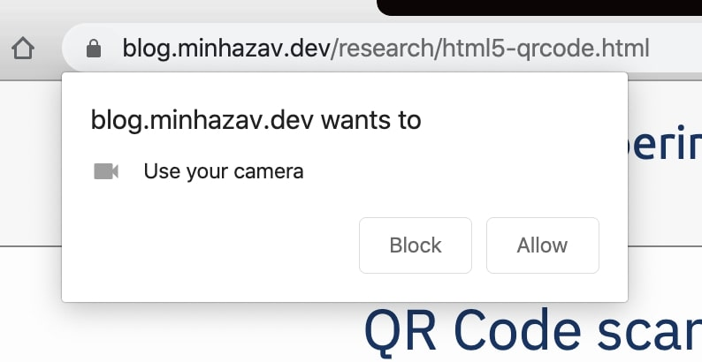
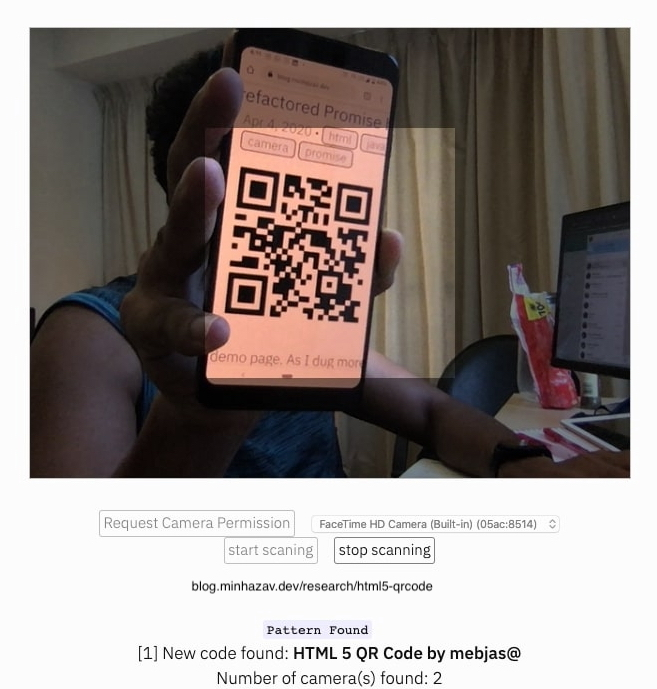

In 2015 I had written an HTML5 based QR code scanning library as a jQuery extension. Recently I realised there was some consistent traffic on [my Github Project](https://github.com/mebjas/html5-qrcode) and the [demo page](https://blog.minhazav.dev/research/html5-qrcode.html). As I dug more into what was going on and I was embarrassed to see the poor design and obsolete support to the latest HTML APIs around Camera. I recently fixed some of the issues and refactored the javascript library that is now independent of jQuery library and supports `Promise` based APIs. In this article I'll explain how to use the new version of the library, some changes and reasons for them and existing issues and plan to fix them. To callout loud, the major changes are:
 - Removed jQuery dependency
 - Refactored the APIs to return [Promise](https://developer.mozilla.org/en-US/docs/Web/JavaScript/Reference/Global_Objects/Promise) rather than being purely based on callbacks.

## Introduction
QR Code is a very common technique of encoding information as images. Its a very common used in physical stores for identifying products like bar code is used.

<br>
_Figure: A sample QR code_

The javascript library available at [mebjas/html5-qrcode](https://github.com/mebjas/html5-qrcode) on Github allows users to add a QR code scanner in their web applications. It works cross-platform and across different devices like PC, Mac or smartphones. It uses the `stream` from the camera and try to decode frames at a certain frequency (configurable) and notify the caller about results via callbacks. Requesting camera permissions in browsers usually results in a permission dialog popup to users for requesting permissions and can only be used if the user grants them.

{:width="400px"}
<br>
_Figure: Sample permission flow triggered by Chrome browser on Mac_

## Demo
A demo for this project is hosted at [https://blog.minhazav.dev/research/html5-qrcode.html](https://blog.minhazav.dev/research/html5-qrcode.html)

## How to use

### Download the Javascript code or use the Github version
The code is hosted at [mebjas/html5-qrcode](https://github.com/mebjas/html5-qrcode) on Github. You can download the library and add it to your codebase from [release page](https://github.com/mebjas/html5-qrcode/releases) or use it directly like:

```html
<script src="https://raw.githubusercontent.com/mebjas/html5-qrcode/master/minified/html5-qrcode.min.js"></script>
```

I highly recommend using the minified version for the following reasons:
 - It's smaller in size and would load faster.
 - The actual code `html5-qrcode.js` is written using ECMAScript which is supported only in the latest browsers. It may not be supported in older browsers. The minified script has been transpiled using `Babel`.

**Not recommended** If you still wish to use the non-minified library, try including these:
```html
<script src="./jsqrcode-combined.js"></script>
<script src="./html5-qrcode.js"></script>
```

### Add a palceholder element in HTML
```html
<div id="reader"></div>
```

Add an empty HTML element at the appropriate position in your HTML code, give it an `id`. The library uses this element to insert some hidden HTML elements which shows up as a viewfinder (camera input is shown in this HTML element) to the user performing QR code scan.

### Enumerate all available cameras
The `Html5Qrcode` exposes a `static` method to enumerate all supported cameras in the device. Calling this method would trigger user permissions as these permissions are required to get the name of the cameras in certain browsers. This method returns a [Promise](https://developer.mozilla.org/en-US/docs/Web/JavaScript/Reference/Global_Objects/Promise) with a list of supported cameras.

```js
// This method will trigger user permissions
Html5Qrcode.getCameras().then(cameras => {
  /**
   * devices would be an array of objects of type:
   * { id: "id", label: "label" }
   */
  if (devices && devices.length) {
    var cameraId = devices[0].id;
    // .. use this to start scanning.
  }
}).catch(err => {
  // handle err
});
```

The returned object is an `Array` of `Object` with the following fields:
 - `id`: Id of the camera. This is needed to start scanning the QR Code.
 - `label`: Label for the camera. This is human-readable name for the camera device like `Front Camera` or `Back Camera`.

### Once you have `cameraId` you can perform start/stop operations
Starting the camera implicitly starts QR Code scanning. It runs at a certain `fps` (frame per seconds) provided in `configuration` argument. This is an optional field and by default the scanner runs at 2 fps.

To `start` scanning you need to create an instance of `Html5Qrcode` and call `start()` API. This method returns a `Promise` which succeeds when QR Code scanning starts: Real-time feed starts to show up and QR code scanning starts. When the code is detected the callback `qrCodeSuccessCallback` is called and when its not detected, the `qrCodeErrorCallback` callback is called. 

```js
// Create instance of the object. The only argument is the "id" of HTML element created above.
const html5QrCode = new Html5Qrcode("reader");

html5QrCode.start(
  cameraId,     // retreived in the previous step.
  {
    fps: 10,    // sets the framerate to 10 frame per second
    qrbox: 250  // sets only 250 X 250 region of viewfinder to
                // scannable, rest shaded.
  },
  qrCodeMessage => {
    // do something when code is read. For example:
    console.log(`QR Code detected: ${qrCodeMessage}`);
  },
  errorMessage => {
    // parse error, ideally ignore it. For example:
    console.log(`QR Code no longer in front of camera.`);
  })
.catch(err => {
  // Start failed, handle it. For example,
  console.log(`Unable to start scanning, error: ${err}`);
});
```

#### Extra optional `configuration` in `start()` method
The configuration argument in `start()` method can effect both scanning behavior and UI. There are two optional properties right now, if you don't want them you can just pass an empty `Object like {}`.

##### `fps` - Integer, Example = `10`
Also known as frame per seconds, the default value for this is `2` but it can be increased to get faster scanning. Increasing to a very high value could affect performance. Value `>1000` will simply fail. Ideal value for this could be `10`.

##### `qrbox` - Integer, Example = `250`
Use this property to limit the region of the viewfinder you want to use for scanning. The rest of the viewfinder would be shaded and ignored by the QR code scanner. For example by passing config `{ qrbox : 250 }`, the screen will look like:

{:width="600px"}<br>

This is an optional property, if nothing is passed, the scanner will scan the entire region of the viewfinder.

#### To stop scanning, use stop() method
The `stop()` member method in `Html5Qrcode` returns a `Promise` which finishes when the video feed is closed and held resources are released.

```js
html5QrCode.stop().then(ignore => {
  // QR Code scanning is stopped.
  console.log("QR Code scanning stopped.");
}).catch(err => {
  // Stop failed, handle it.
  console.log("Unable to stop scanning.");
});
```

> This should only be called after QR Code has been started successfully.

For more clarity I have dumped the `javascript` code used in demo in [this public gist](https://gist.github.com/mebjas/729c5397506a879ec704075c8a5284e8).
> This code uses jQuery but it's not really needed.

## Changelog in v1.0.0
 - Removed `jQuery` dependency
 - Refactored the library to `Promise` based APIs.
 - Refactored the code to [ECMAScript](https://www.w3schools.com/js/js_es6.asp)
 - Merged `Babel` transpiled minifed library with `jsqrcode` to a single `52Kb` library.

## Cross-platform support
I am working on adding support for more and more platforms. If you find a platform or browser where the library is not working please feel free to file an issue. Check the [demo link](https://blog.minhazav.dev/research/html5-qrcode.html) to test out.

##### Legends
 -  Means supported 
 -  Means work in progress to add support

### Windows / Mac OS

| <br/>Firefox | <br/>Chrome | <br/>Safari | <br/>Opera | <br/> Edge
| --------- | --------- | --------- | --------- | ------- |
|| | |  | 

### Android

| <br/>Chrome | <br/>Firefox | <br/> Edge | <br/>Opera | <br/> Opera Mini |  <br/> UC
| --------- | --------- | --------- | --------- |  --------- | --------- |
|| | | |  |  

### IOS

|<br/>Safari | <br/>Chrome | <br/>Firefox | <br/> Edge
| --------- | --------- | --------- | --------- |
|  |  |  |  |

<br>
> Apparently, Webkit for IOS is used by Chrome, Firefox, and other browsers in IOS and they do not have webcam permissions yet. There is an ongoing issue on fixing the support for iOS - [issue/14](https://github.com/mebjas/html5-qrcode/issues/14)

## Existing issues and plan to fix them
In [milestore/v1.0.1](https://github.com/mebjas/html5-qrcode/milestone/1) I plan to fix compatibility issues with `Opera` browser and `IOS` based browsers.

Some open issues are:
 - [issue/14](https://github.com/mebjas/html5-qrcode/issues/14) - Fix camera query issue in IOS browsers - Chrome, Mozilla, Edge, Opera.
 - [FIXED] ~~[issue/14](https://github.com/mebjas/html5-qrcode/issues/14) - Fix stuck camera issues in IOS Safari~~
 - [issue/13](https://github.com/mebjas/html5-qrcode/issues/13) - Fix camera query issue in Android Opera Mini
 - [FIXED] ~~[issue/16](https://github.com/mebjas/html5-qrcode/issues/16) - Fix Camera Query issue in Mac OS Opera browser~~

## How to contribute
If you are excited or interested you can contribute to this project by:

 - If you find compatibility issues with certain browser, [create an issue here](https://github.com/mebjas/html5-qrcode/issues/new?assignees=&labels=compatibility&template=compatibility-issue.md&title=Compatibility+-+%5BOS%5D+%5BBrowser%5D+-+%5BWhat+is+not+working%5D).
 - Raising issues for bugs faced, at [Github issue page for the project](https://github.com/mebjas/html5-qrcode/issues). Feel free to add some related interesting discussions which could be taken up as work-item.
 - Sending a Pull Request for bugs fixed by you.
 - Rating the project with stars and shares.

## License and Credits

 - The library is released under [Apache License, Version 2.0](https://github.com/mebjas/html5-qrcode/blob/master/licence.md).
 - The decoder used for the QRcode reading is from `LazarSoft` - [LazarSoft/jsqrcode](https://github.com/LazarSoft/jsqrcode).

## Updates to this article
 - `18th April 2020` - [Added support for local file scanning and using default camera on smartphones](https://blog.minhazav.dev/HTML5-QR-Code-scanning-support-for-local-file-and-default-camera/)