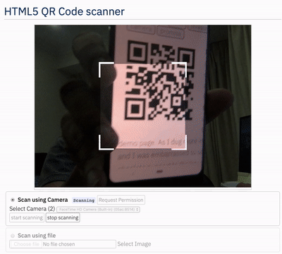
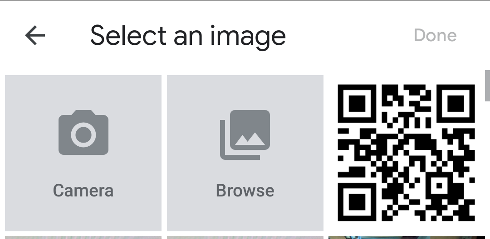
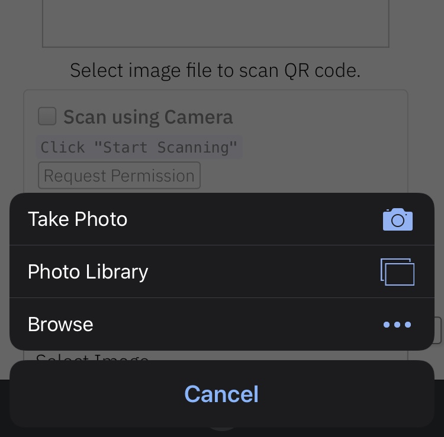

<a href='https://github.com/mebjas/html5-qrcode'>html5-qrcode</a> helps developer to integrate QR code scanning in HTML5 based applications. It abstracts camera access and usage on different browsers and simplify QR Code scanning for developers. The primary goal of the library is cross-platform support across different OS versions and Browsers. One of the key problems with cross-platform support was some browsers in Android and many browsers in iOS (almost all other than Safari which are based on WebKit for iOS) did not support camera access. This prevents users from doing inline QR Code scanning which is the primary feature of the library. To mitigate this I have added support for scanning local media on the device and it implicitly adds support for capturing QR Code using default camera on the device and scanning it. This is an upgrade to the existing library - you can read more about it <a href='../HTML5-QR-Code-scanning-launched-v1.0.1/'>here</a>. In this article I have explained now file-based scanning works and how to use it.

## Changelog
 - Added support for scanning local images on the device.
 - Added support for capturing an image using the camera on the phone and scanning it.
 - Added API to clear existing canvas.

The library has been updated to npm and a [v1.0.5](https://github.com/mebjas/html5-qrcode/releases/tag/v1.0.5) is released in Github.<br>
[](https://www.npmjs.com/package/html5-qrcode)

**Great thing is - this extends the library to work on almost all OS types and browsers.**

## Demo
A demo for this project is hosted at [blog.minhazav.dev/research/html5-qrcode.html](https://blog.minhazav.dev/research/html5-qrcode.html)

## Issue with inline scanning
If you look at the [issue 14](https://github.com/mebjas/html5-qrcode/issues/14) on the [Github project](https://github.com/mebjas/html5-qrcode)
> Compatibility - [ios] [All Browser] - [Query Camera]
>
>> Query camera is not working for Opera, Edge, Firefox and Chrome.
>> OS: iOS in Iphone 7 and IPad 9.7

The root cause for this was an issue in Webkit for IOS which is used by almost all these browsers in IOS. The issue was - it doesn't permit browsers other than Safari to access Camera on the device. Check this [StackOverflow question](https://stackoverflow.com/questions/51501642/chrome-and-firefox-are-not-able-to-access-iphone-camera) for more info. This is very sly and has been there for many years with no progress. To make sure this library can be used cross-platform I have added a fallback type approach which allows users to either capture the QR Code using default camera or load a media from disk. This solution is not perfect but can be used to have good support for QR Scanning in the app.

You can use it something like this:<br>
<br>
_Figure: QR Code scanning with both the inline viewfinder and file scanning option_.

## How this works
HTML5 supports `input` type `file` which allow accessing files locally using javascript with user consent. Adding `capture` tag can be used to restrict the option to capture using a camera alone for Android and IOS while it is ignored in PC browsers. When a user clicks on the file input following types of dialogs are shows in different OS:

| Selector in Android | Selector in IOS|
|------|-------|
{:width="300px"} |  {:width="300px"} |
|Taken on Pixel 3, Google Chrome | Taken on iPhone 7, Google Chrome |


## How to use
Apart from the standard steps described [here](../HTML5-QR-Code-scanning-launched-v1.0.1/#how-to-use) like:

**Include the library**
```html
<script 
    src="https://raw.githubusercontent.com/mebjas/html5-qrcode/master/minified/html5-qrcode.min.js">
</script>
```

Or download it using `npm`<br>
[](https://www.npmjs.com/package/html5-qrcode)

**Add placeholder element**
```html
<div id="reader"></div>
```

### Add `input` of type `file`
```html
<input type="file" id="qr-input-file" accept="image/*">
<!-- 
  Or add captured if you only want to enable smartphone camera, PC browsers will ignore it.
-->

<input type="file" id="qr-input-file" accept="image/*" capture>
```
Find more information about input tags at [developers.google.com](https://developers.google.com/web/fundamentals/media/capturing-images).

### Use `Html5Qrcode#scanFile()` API to scan an image `File`.
The new API looks like this:
```js
/**
 * Scans an Image File for QR Code.
 * 
 * This feature is mutually exclusive to camera based scanning, you should call
 * stop() if the camera based scanning was ongoing.
 * 
 * @param {File} imageFile a local file with Image content.
 * @param {boolean} showImage if true the Image will be rendered on given element.
 * 
 * @returns Promise with decoded QR code string on success and error message on failure.
 *            Failure could happen due to different reasons:
 *            1. QR Code decode failed because enough patterns not found in image.
 *            2. Input file was not image or unable to load the image or other image load
 *              errors.
*/
scanFile(imageFile, showImage /* default = true */) {}
```
 - `imageFile` is of type `File`. It's the argument which you get from `change` lisntener on the `<input type='file' />`.
 - `showImage` is an optional boolean argument, with default value = `true`. If this is true the library will render the user image on `<div id="reader"></div>`, otherwise not.

This is a `Promise` based API which returns the decoded QR Code message on success and error message on failure. The error could happen at different levels like image loading or QR Code scanning.

#### And in javascript code initialize the object and attach listener like this:
```js
const html5QrCode = new Html5Qrcode(/* element id */ "reader");

// File based scanning
const fileinput = document.getElementById('qr-input-file');
fileinput.addEventListener('change', e => {
  if (e.target.files.length == 0) {
    // No file selected, ignore 
    return;
  }

  // Use the first item in the list
  const imageFile = e.target.files[0];
  html5QrCode.scanFile(imageFile, /* showImage= */true)
  .then(qrCodeMessage => {
    // success, use qrCodeMessage
    console.log(qrCodeMessage);
  })
  .catch(err => {
    // failure, handle it.
    console.log(`Error scanning file. Reason: ${err}`)
  });
});
```

**Important**
> Note that inline scanning and file-based scanning are mutually exclusive at the moment. This means, you can only use one of them at a time. I'll soon be adding support for the option to have both if the requirement comes in. If you want to use both, use html5QrCode#clear() method to clear the canvas.

### Clearing the canvas after use
Since unlike the inline scanning this API doesn't support `start()` and `stop()` you can use:
```js
html5QrCode.clear();
```
API to clear the canvas after use.

## My recommendation
Add support for both inline scanning and file-based approach in your app like shown in the [demo](https://blog.minhazav.dev/research/html5-qrcode.html). This will allow users to use which ever works for them irrespective of the browser they are on.
